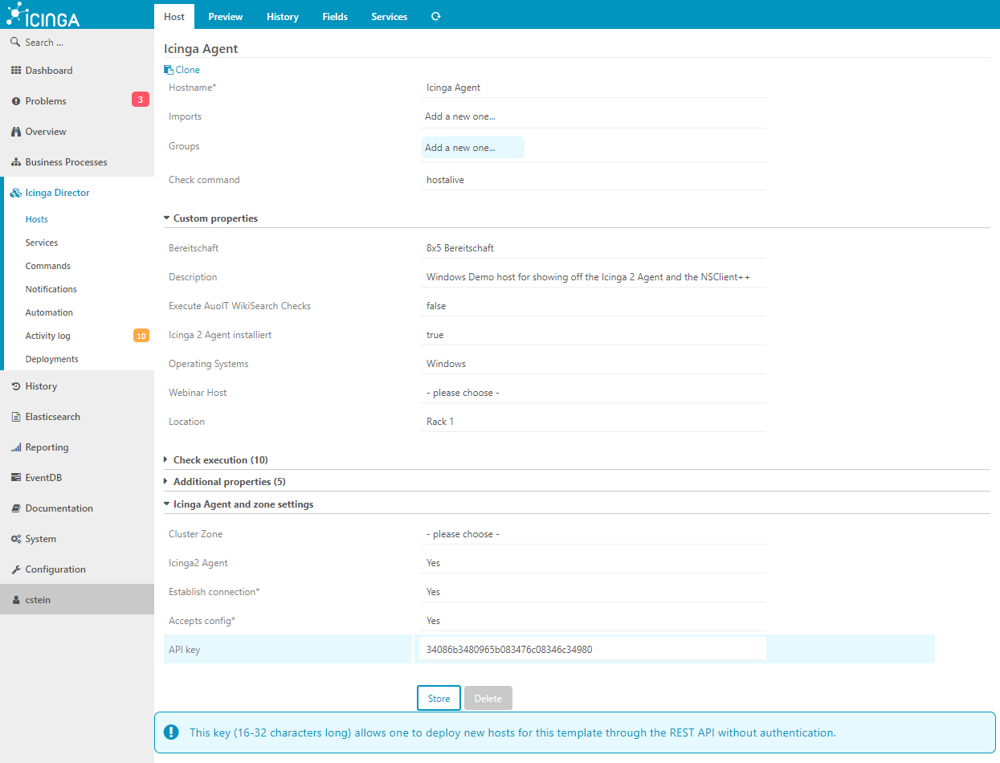
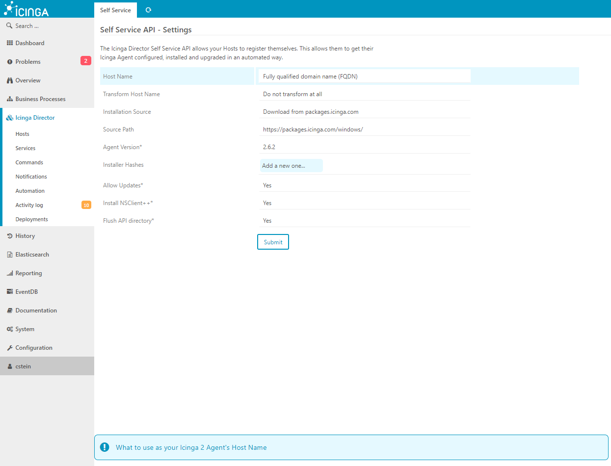

Automation of the Installation
==============

To make the entire rollout of Icinga 2 Agents on plenty of Windows Systems easier, the module allows 
to connect to the Icinga Director (the Windows host requires to access the Icinga Director Host), 
fetching all required informations over the Icinga Director Self Service API.

For this feature you will require the Icinga Director API version 1.4.0 or higher. On older Director 
versions, this feature is not possible with the following example. Please take a look on 
[the examples](30-Examples.md) to partly achieve these goals with a little more configuration effort.

Prepare the Icinga Director
-------------

### Setup Host-Templates for Agents

At first ensure that your Windows hosts can basicly access the Icinga 2 Web interface.

For the automation process, we will require to create Host-Templates with an **API key** and all our 
basic stuff for this specific kind of Windows system.



Within the template you can define all kind of custom variables which will be automaticly applied. In 
case you are going to monitor Exchange, Active Directory or other servers, you can define templates 
for each kind with an own API key.


### Configure the Self-Service API

Configure the Self Service API over Icinga Director -> Icinga Infrastructure -> Self Service API



Here you can globally configure how the name of the Windows machine will be fetched and processed, 
if you with to install the Icinga 2 including the Version and if the NSClient should be installed.

All defined values will be fetched by the PowerShell module over the API key and processed internally.


### Writing the PowerShell Code

An entire code example on how to call the PowerShell module can be found below:

```powershell
    $icinga = Icinga2AgentModule `
                  -DirectorUrl       'https://icinga2-master.example.com/icingaweb2/director/' `
                  -DirectorAuthToken '34086b3480965b083476c08346c34980'

    $icinga.install();
```

Now the PowerShell module will connect to this host over the Web-Api and fetch all basic arguments 
from the Icinga Director as configured within the Self-Service API.

In case the host is not already added, the PowerShell module will add it and receive a Host-Api-Key 
in return which is written locally to the disk and loaded every time again the module is called to 
allow fetching configuration values and to automaticly apply possible changes on zones, endpoints or 
to install a new Icinga 2 version.